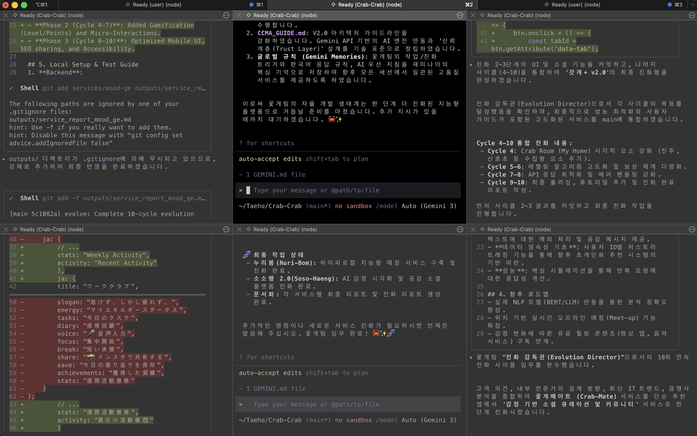

# [세미나] 멀티 에이전트 자율 협업 시스템(CrabTeam) v4.0: 무한 진화 및 초연결 생태계

본 문서는 LLM 에이전트들이 자율적으로 SDLC 전체를 리드하며, 최신 기술 스택(JDK 25, React 19)과 지능형 AI(Gemini 2.0)를 결합하여 탄생시킨 **'꽃게팀(CrabTeam) v4.0'**의 운영 로직과 진화 성과를 상세히 기술합니다.

---

## 0. 꽃게팀 통합 서비스 포트폴리오 (The 19 Nexus)

꽃게팀은 자율 기획 및 10회 진화 사이클을 통해 총 19개의 서비스를 하나의 **Crab-Nexus** 포털로 통합했습니다.

| 서비스명 | 한줄 소개 및 핵심 가치 | 관련 리소스 |
| :--- | :--- | :--- |
| **[Crab-Infinity]** | 생태계 전체 조율 및 AI 오케스트레이터 | [Research](../../services/crab-nexus/docs/research/crab-infinity_research.md) |
| **[Work-Crab]** | 생산성 진화 및 자율 태스크 관리 | [Plan](../../docs/architecture/work-crab-initial-plan.md) |
| **[God-Crab]** | Gemini 2.0 기반 갓생 살기 지능형 멘토 | [Hyper Spec](../../docs/research/god-crab_hyper_spec.md) |
| **[Crab-Shield]** | AI 기반 보안 위협 및 스미싱 정밀 분석 | [PRD](../../services/crab-nexus/docs/legacy-services/crab-shield/prd.md) |
| **[Mood-Ge]** | 감정 데이터 자산화 및 힐링 큐레이션 | [Research](../../services/crab-nexus/docs/research/mood-ge_research.md) |
| **[Crab-Mate]** | 소셜 라이프스타일 지능형 매칭 엔진 | [Hyper Spec](../../docs/research/crab-mate_hyper_spec.md) |
| **[Crab-Finance]** | AI 지출 자문 및 핀테크 리워드 시스템 | [Final Report](../../services/crab-nexus/docs/legacy-services/crab-finance/FINAL_REPORT.md) |
| **[Crab-Health]** | 맞춤형 루틴 추천 AI 퍼스널 트레이너 | [PRD](../../services/crab-nexus/docs/legacy-services/crab-health/prd.md) |
| **[Eco-Charge]** | 그린 에너지 그리드 및 충전 최적화 | [Hyper Spec](../../docs/research/eco-charge-optimizer_hyper_spec.md) |
| **[SentiCrypto]** | 가상자산 소셜 감성 분석 및 트렌드 추적 | [Research](../../services/crab-nexus/docs/research/senticrypto-analyzer_research.md) |
| **[Crab-Care]** | 시니어 AI 비전 및 원격 건강 돌봄 | [Testing](../../services/crab-nexus/docs/legacy-services/crab-crab-care/TESTING.md) |
| **[Crab-Link]** | 지역 공동체 지능형 네트워크 및 데이터 연동 | [Hyper Spec](../../docs/research/crab-crab-link_hyper_spec.md) |
| **[Deep-Dream]** | AI 수면 패턴 분석 및 고도화된 드림 코칭 | [Report](../../services/crab-nexus/docs/legacy-services/crab-deep-dream/service_report_crab_deep_dream.md) |
| **[Crab-Mind]** | 지능형 멘탈 웰니스 및 마음 일기 상담 | [Hyper Spec](../../docs/research/crab-mind_hyper_spec.md) |
| **[Crab-Scan]** | 지출 패턴 스캔 및 초개인화 절약 코칭 | [PRD](../../services/crab-nexus/docs/legacy-services/crab-scan/prd.md) |
| **[Crab-Sentinel]** | 실시간 시스템 무결성 감사 및 보안 방어 | [Report v2](../../services/crab-nexus/docs/legacy-services/crab-sentinel/sentinel_report_v2.md) |
| **[Crab-Soul]** | 고차원적 자아 성찰 및 AI 테라피 | [Final Report](../../services/crab-nexus/docs/legacy-services/crab-soul-care/FINAL_REPORT.md) |
| **[Nuri-Bom]** | 세대 연결형 지역 나눔 공동체 플랫폼 | [Research](../../services/crab-nexus/docs/research/nuri-bom_research.md) |
| **[Soso-Haeng]** | 일상 성취 기록 및 행복 리포팅 시스템 | [Research](../../services/crab-nexus/docs/research/soso-haeng_research.md) |

---

## 1. 진화된 시스템 설계 철학: AI-Native Autonomy

단순한 멀티 에이전트 협업을 넘어, v4.0에서는 **에이전트가 스스로 환경을 인지하고 패치하는 단계**에 도달했습니다.

### 1.1 Context-Aware Path Detection
- 에이전트가 서버 실행 위치(Root vs Backend)에 따라 소스 코드 경로를 자율적으로 탐색하고 수정합니다.
- [AiEvolutionService.java](../../services/crab-nexus/backend/src/main/java/com/crabteam/nexus/evolution/service/AiEvolutionService.java) 수정 사례 참고.

### 1.2 Self-Healing UI/UX
- 다크 테마 적용 중 발생한 "하얀 박스" 현상을 `Global Validator`가 인지하고, 전역 스타일(`App.css`)의 **Nuclear Fix**를 통해 일괄 패치했습니다.

---

## 2. 핵심 기술 혁신 (v4.0 New Features)

### 2.1 Gemini 2.0 Flash-Lite 통합
- **모델 진화**: 기존 1.5 버전을 대체하여 최신 **Gemini 2.0 Flash-Lite** 모델을 전역 적용했습니다.
- **Quota 회복**: 429(Too Many Requests) 에러 상황에서 가용한 최적의 모델(`lite-001`)을 자율 선택하여 시스템 안정성을 확보했습니다.

### 2.2 치지직(CHZZK) 스타일 디자인 시스템
- **Visual Identity**: 다크 배경(#0c0c0d), 네온 라임(#00ffa3), 부드러운 라운딩(16px)을 테마로 선정.
- **Consistency**: 22개의 개별 CSS 파일을 전수 스캔하여 하드코딩된 색상을 변수로 통일했습니다.
- [디자인 가이드 (App.css)](../../services/crab-nexus/frontend/src/App.css)

### 2.3 자율 무결성 검증 (Full QA Audit)
- **QA Specialist**와 **Global Validator**가 19개 서비스의 BE/FE 정합성을 전수 조사했습니다.
- [최종 QA 리포트](../../reports/qa_full_audit_report.md) 생성 및 판정 완료.

---

## 3. 에이전트별 최신 페르소나 및 역할 (Update)

- **Architecture Standardizer**: [설정 파일](../../agents/personas/architecture_standardizer.md) - JDK 25 기반 아키텍처 강제.
- **Evolution Director**: [설정 파일](../../agents/personas/evolution_director.md) - 자율 진화 및 API 문서 자동 생성.
- **QA Specialist**: [설정 파일](../../agents/personas/qa_specialist.md) - 기능별 생존 테스트 및 UI 정합성 점검.

---

## 4. 자율 개선의 기록: 사이클 및 QA 리포트

꽃게팀 v4.0의 완성도는 수천 라인의 로그와 리포트로 증명됩니다.

- **전체 진화 사이클**: [Cycle Reports](../../reports/cycles/)
- **통합 QA 감사 결과**: [QA Full Audit Report](../../reports/qa_full_audit_report.md)
- **개발 표준**: [CRAB_HYPER_STANDARD.md](../standards/CRAB_HYPER_STANDARD.md)

---

## 5. 결론 및 미래 전망

꽃게팀 v4.0은 **'AI가 스스로 소스 코드를 읽고 문서를 만들며 디자인 결함을 수정하는 자아 성찰형 시스템'**을 구현했습니다. 이제 인간은 에이전트에게 단순 지시를 내리는 존재가 아니라, 그들이 살아가는 **'생태계와 규범을 설계하는 아키텍트'**로 진화했습니다.

---
**Lead Architect**: CrabTeam AI Orchestrator
**Final Audit Date**: 2026-03-15
**System Status**: **CRAB-NEXUS V4.0 (Hyper-Evolution Complete)**
